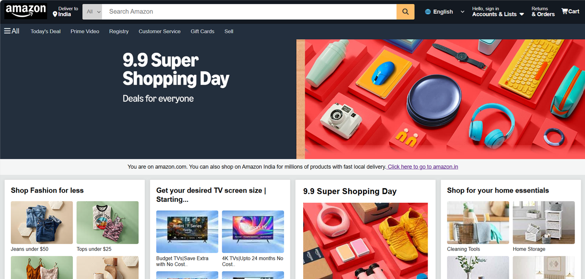

# Amazon Homepage Clone
A pixel-accurate clone of the Amazon homepage built as a front-end practice project, focusing on layout structure and component replication.

## What I Focused On
- Multi-column grid layouts for product card sections
- Responsive navbar with search bar and navigation links
- Hover effects on product cards
- Footer with multi-column link structure

## Tech Stack
- HTML5
- CSS3
- Tailwind CSS

## How to Run
Open `main.html` in any browser. No installation required.

## Screenshot

